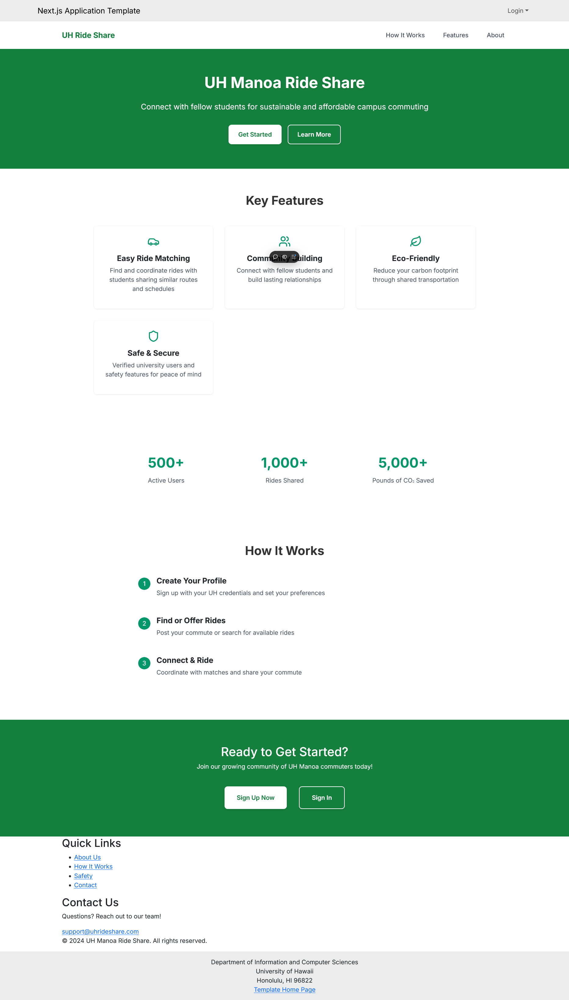

# UH Manoa Ride Share

## Overview

UH Manoa Ride Share is a web application designed to address a critical challenge faced by UH Manoa students: the difficulties of campus commuting. With limited, expensive parking and sometimes inconvenient public transportation options, many students resort to driving alone, contributing to increased traffic, higher transportation costs, and elevated carbon emissions.

Our solution connects students who share similar routes and schedules, facilitating an efficient carpooling system that benefits both the community and the environment.

## Goals

- **Reduce Transportation Costs**: Help students save money by sharing commuting expenses
- **Ease Parking Demand**: Decrease the number of single-occupancy vehicles requiring parking on campus
- **Environmental Impact**: Lower carbon emissions by promoting shared rides
- **Community Building**: Foster connections between students through collaborative transportation
- **Enhanced Safety**: Implement features to ensure secure and reliable ride sharing

## Key Features

### 1. Welcome Page
- User registration and authentication
- Visual guide for posting/finding rides
- Student testimonials
- Community impact statistics

### 2. User Dashboard
- Profile summary with photo and basic info
- Ride preferences and ratings
- Active ride management (offered/requested)
- Real-time notifications
- Personal eco-impact statistics

### 3. Ride Posting
- Comprehensive trip detail form
- Recurring ride scheduling
- Automated cost calculator
- Route customization

### 4. Ride Search
- Advanced filtering system
- Interactive map view
- Driver preference matching
- Real-time availability updates

### 5. User Profiles
- Detailed user information
- Ride history and ratings
- Preference settings
- Community reputation system

## Special Features

### Carpool Mapping
- Dynamic route optimization
- Real-time traffic updates
- Pickup/dropoff coordination
- Travel time estimation

### Community Board
- Event-based carpooling
- Study group coordination
- Campus activity ride sharing
- Community engagement opportunities

### Safety Features
- Real-time location sharing
- Trusted contact system
- Trip monitoring
- Emergency assistance access

## Use Cases

### Daily Commuter
Sarah, a regular commuter to UH Manoa, uses the app to:
- Share her daily route
- Split fuel costs
- Reduce parking stress
- Connect with fellow students

### Environmental Champion
Users can:
- Track carbon footprint reduction
- Earn eco-badges
- Contribute to campus sustainability
- Promote green transportation

### Semester Schedule Matching
Rachel and Josh demonstrate how students can:
- Coordinate recurring rides
- Match class schedules
- Build reliable transportation partnerships
- Share semester-long commutes

## Project Team

- Justin Campos
- Jayda Decker
- Karina Park
- Lyon Singleton
- Baishen Wang

## Development Status

This project is currently in the initial development phase. We are:
- Setting up the development infrastructure
- Finalizing design mockups
- Planning the implementation timeline
- Building our core features

## Team Contract

View our team contract [here](https://docs.google.com/document/d/1-mcSvmThZ-aZ6_CZlB_yksfq7MiZ57kAd3QDrStG7zA/edit?tab=t.0)

## M1 Page

[https://github.com/orgs/UH-Uber/projects/1](https://github.com/orgs/UH-Uber/projects/1)
 
## M2 Page
[https://github.com/orgs/UH-Uber/projects/3](https://github.com/orgs/UH-Uber/projects/3)

## Deployment Link on Vercel 

[https://uh-uber-source-code.vercel.app/](https://uh-uber-source-code.vercel.app/)

## Get Involved

We welcome contributions and feedback! To get involved:
- Visit our [GitHub repository](https://github.com/UH-Uber/UH-Uber-SourceCode)
- Report issues or suggest features
- Contact the development team
- Follow our progress updates

## Current state

## Mockup Pages

---
Last Updated: November 19, 2024
