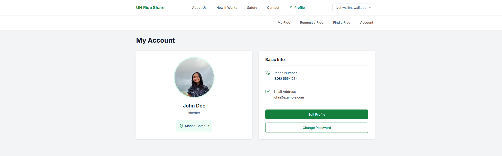
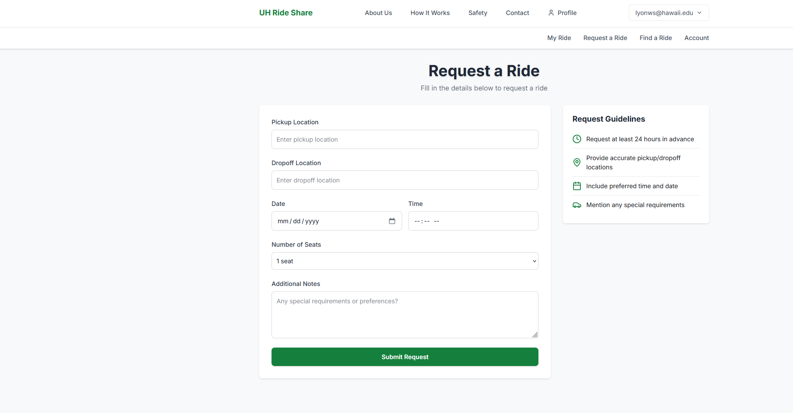
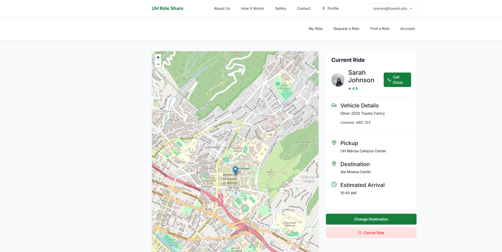

# UH Manoa Ride Share

## Overview

UH Manoa Ride Share is a web application designed to address a critical challenge faced by UH Manoa students: the difficulties of campus commuting. With limited, expensive parking and sometimes inconvenient public transportation options, many students resort to driving alone, contributing to increased traffic, higher transportation costs, and elevated carbon emissions.

Our solution connects students who share similar routes and schedules, facilitating an efficient carpooling system that benefits both the community and the environment.

## Goals

- **Reduce Transportation Costs**: Help students save money by sharing commuting expenses
- **Ease Parking Demand**: Decrease the number of single-occupancy vehicles requiring parking on campus
- **Environmental Impact**: Lower carbon emissions by promoting shared rides
- **Community Building**: Foster connections between students through collaborative transportation
- **Enhanced Safety**: Implement features to ensure secure and reliable ride sharing

## Key Features

### 1. Welcome Page
- User registration and authentication
- Visual guide for posting/finding rides
- Student testimonials
- Community impact statistics

### 2. User Dashboard
- Profile summary with photo and basic info
- Ride preferences and ratings
- Active ride management (offered/requested)
- Real-time notifications
- Personal eco-impact statistics

### 3. Ride Posting
- Comprehensive trip detail form
- Recurring ride scheduling
- Automated cost calculator
- Route customization

### 4. Ride Search
- Advanced filtering system
- Interactive map view
- Driver preference matching
- Real-time availability updates

### 5. User Profiles
- Detailed user information
- Ride history and ratings
- Preference settings
- Community reputation system

## Special Features

### Carpool Mapping
- Dynamic route optimization
- Real-time traffic updates
- Pickup/dropoff coordination
- Travel time estimation

### Community Board
- Event-based carpooling
- Study group coordination
- Campus activity ride sharing
- Community engagement opportunities

### Safety Features
- Real-time location sharing
- Trusted contact system
- Trip monitoring
- Emergency assistance access

## Use Cases

### Daily Commuter
Sarah, a regular commuter to UH Manoa, uses the app to:
- Share her daily route
- Split fuel costs
- Reduce parking stress
- Connect with fellow students

### Environmental Champion
Users can:
- Track carbon footprint reduction
- Earn eco-badges
- Contribute to campus sustainability
- Promote green transportation

### Semester Schedule Matching
Rachel and Josh demonstrate how students can:
- Coordinate recurring rides
- Match class schedules
- Build reliable transportation partnerships
- Share semester-long commutes

## Project Team

- Justin Campos
- Jayda Decker
- Karina Park
- Lyon Singleton
- Baishen Wang

## Development Status

This project is currently in the initial development phase. We are:
- Setting up the development infrastructure
- Finalizing design mockups
- Planning the implementation timeline
- Building our core features

## Team Contract

View our team contract [here](https://docs.google.com/document/d/1-mcSvmThZ-aZ6_CZlB_yksfq7MiZ57kAd3QDrStG7zA/edit?tab=t.0)


## M1 Page

[https://github.com/orgs/UH-Uber/projects/1](https://github.com/orgs/UH-Uber/projects/1)
 
## M2 Page
[https://github.com/orgs/UH-Uber/projects/3](https://github.com/orgs/UH-Uber/projects/3)

## M3 Page
[https://github.com/orgs/UH-Uber/projects/4](https://github.com/orgs/UH-Uber/projects/4)

## Deployment Link on Vercel 

[https://uh-uber-source-code.vercel.app/](https://uh-uber-source-code.vercel.app/)


# UH Manoa Ride Share Documentation

## User Guide

### Getting Started

#### Landing Page

The landing page is your gateway to the UH Manoa Ride Share system. Here you can:
- View an overview of the ride-sharing service
- Access the registration and login options
- Learn about the platform's key features
- See community impact statistics

#### User Registration and Login
To use the system, you'll need to create an account:
1. Click the "Sign Up" button
2. Enter your UH email address and create a password
3. Complete your profile information
4. Verify your email address

### Core Features

#### Profile Management

On your profile page, you can:
- Upload a profile picture
- Update your personal information
- Set your ride preferences
- View your ride history and ratings
- Manage your account settings

#### Finding a Ride

To find available rides:
1. Navigate to the "Find a Ride" page
2. Use the search filters to specify:
   - Departure location
   - Destination
   - Date and time
   - Preferred number of passengers
3. Browse through available rides
4. View driver profiles and ratings
5. Select and request your preferred ride

#### Creating a Ride Request

To offer or request a ride:
1. Click on "Create a Ride Request"
2. Fill in the required details:
   - Pick-up location
   - Destination
   - Date and time
   - Available seats
   - Cost sharing preferences
3. Submit your request

#### Tracking Ride Status

Monitor your rides through the status page:
- View accepted ride requests
- Track ongoing rides
- Check ride history
- Manage ride details and arrangements

### Safety Features
- Real-time location sharing during rides
- Emergency contact system
- User verification process
- Rating and review system

## Developer Guide

### System Requirements
- Node.js (v18 or higher)
- npm or yarn package manager
- Git
- PostgreSQL database

### Getting Started

1. Clone the repository:
```bash
git clone https://github.com/UH-Uber/UH-Uber-SourceCode.git
cd UH-Uber-SourceCode
```

2. Install dependencies:
```bash
npm install
```

3. Set up environment variables:
- Copy `.env.example` to `.env`
- Configure the following variables:
  ```
  DATABASE_URL=your_database_url
  NEXTAUTH_SECRET=your_secret
  NEXTAUTH_URL=http://localhost:3000
  ```

4. Set up the database:
```bash
npx prisma migrate dev
npx prisma generate
```

5. Run the development server:
```bash
npm run dev
```

### Project Structure

```
UH-Uber-SourceCode/
├── src/
│   ├── app/           # Next.js pages and routing
│   ├── components/    # Reusable React components
│   ├── lib/          # Utility functions and configurations
│   └── styles/       # CSS modules and global styles
├── prisma/           # Database schema and migrations
├── public/           # Static assets
└── tests/           # Test files
```

### Key Components

#### Authentication (src/app/auth)
- Handles user registration and login
- Manages session state
- Implements password recovery

#### Ride Management (src/app/find-ride, src/app/request-ride)
- Ride creation and search functionality
- Request handling
- Status updates

#### User Profiles (src/app/profile)
- Profile management
- User preferences
- Rating system

### Database Schema
The application uses Prisma ORM with PostgreSQL. Key models include:
- User
- Ride
- Request
- Rating
- Location

### Testing
Run the test suite:
```bash
npm run test
```

### Deployment
The application is deployed on Vercel:
1. Connect your GitHub repository to Vercel
2. Configure environment variables
3. Deploy using Vercel's automated pipeline

### Contributing
1. Fork the repository
2. Create a feature branch
3. Make your changes
4. Submit a pull request

### Troubleshooting
Common issues and solutions:
- Database connection errors: Check your DATABASE_URL
- Authentication issues: Verify NEXTAUTH configuration
- Build errors: Clear .next directory and node_modules

For more information, visit our [GitHub repository](https://github.com/UH-Uber/UH-Uber-SourceCode).


## Get Involved

We welcome contributions and feedback! To get involved:
- Visit our [GitHub repository](https://github.com/UH-Uber/UH-Uber-SourceCode)
- Report issues or suggest features
- Contact the development team
- Follow our progress updates


---
Last Updated: December 2, 2024
